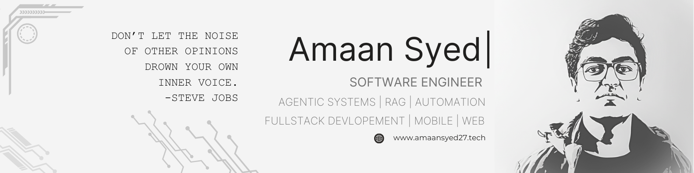

  
  
  
  

---

### 👋 About Me

I'm a software developer and **AI Engineer** specializing in **Agentic AI systems** and automation pipelines. Currently a CS undergrad at **VIT Bhopal**. Previously, I interned at **VideoDB** where I built video AI workflows.

---

### 🏅 Recognition & Achievements

  

  
  
  
  

---

### 🛠️ Tech Stack

  

  <marquee behavior="scroll" direction="left" scrollamount="5">
    <b>AI Specializations:</b> Agentic AI • LLM Pipelines • Computer Vision • Automation • RAG Systems • Vector Databases
  </marquee>

---

### 📂 Featured Works
*A dynamic matrix of my AI-powered systems and developer tools.*

<table align="center">
  <tr>
    <td>
      
    </td>
    <td>
      
    </td>
  </tr>
  <tr>
    <td>
      
    </td>
    <td>
      
    </td>
  </tr>
  <tr>
    <td>
      
    </td>
    <td>
      
    </td>
  </tr>
</table>

  

---

### 📊 Activity Dashboard

  

  

  

---

  🏎️ 
  <i>"If you no longer go for a gap that exists, you're no longer a racing driver."</i> 
  — <b>Ayrton Senna</b>

  

  

